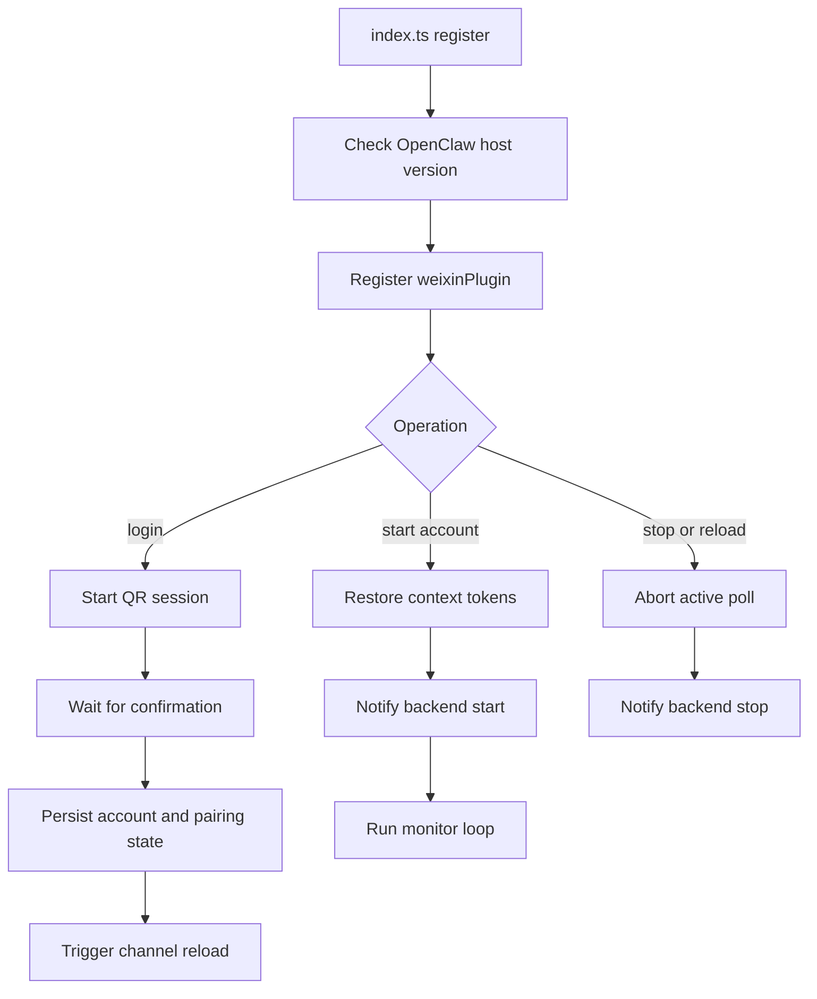
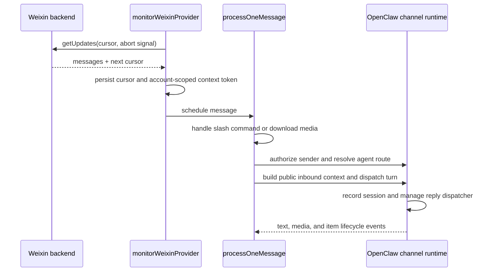
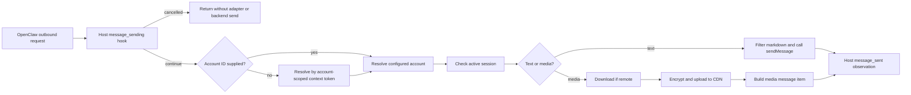

# Architecture

[简体中文](../zh-CN/architecture.md)

`openclaw-weixin` adapts the Weixin HTTP/CDN protocol to the OpenClaw channel
runtime. The plugin owns login, account state, long polling, message conversion,
and outbound media transfer. OpenClaw owns routing, sessions, command
authorization, reply generation, hooks, and the unified media store.

The wire-level endpoint and message shapes are documented in the
[backend API protocol](./backend-api.md).

## Component map

| Component | Responsibility |
| --- | --- |
| `index.ts` | Validate host compatibility and register the channel |
| `src/channel.ts` | Implement the OpenClaw channel contract and account lifecycle |
| `src/auth/` | QR login, account persistence, ID compatibility, and pairing |
| `src/api/` | Build authenticated backend requests and classify failures |
| `src/monitor/monitor.ts` | Poll updates, persist cursors, and schedule inbound work |
| `src/messaging/process-message.ts` | Authorize, route, prepare context/media, and deliver one inbound message |
| `src/messaging/inbound-turn.ts` | Select the public host dispatch contract and adapt hook/lifecycle ownership |
| `src/messaging/send*.ts` | Convert outbound text/media to backend message items |
| `src/cdn/`, `src/media/` | Encrypt, upload, download, decrypt, and transcode media |
| `src/storage/` | Resolve state paths and persist the polling cursor |

## Plugin and account lifecycle

The plugin/channel ID and state layout are compatibility surfaces. A successful
login may replace stale account records for the same Weixin user, but it must not
silently merge unrelated accounts.

## Inbound flow

Ordinary messages are serialized until OpenClaw accepts the turn, after which
polling can admit the next message. Plugin approval commands use a separate lane
so an active ordinary turn cannot block approval.

`inbound-turn.ts` uses `inbound.buildContext` and selects `inbound.dispatch`, or
the public legacy `inbound.dispatchReply` only when `dispatch` is absent. Both
delegate session recording and dispatcher cleanup to the host; errors never
trigger a retry through the other contract. The OpenClaw 2026.6.1 minimum and
account-scoped state remain unchanged. Deferred replies retain their progress
sender until the host's completion callback, not merely the initial dispatch
return.

## Outbound flow

Modern inbound and direct outbound sends use host-owned hooks. Legacy inbound
and independent debug sends retain local hooks; the legacy identity
`beforeDeliver` disables the SDK's duplicate text modifier. Raw delivery returns
existing client message IDs and never re-enters another hook-owning send path.

With multiple accounts, an omitted account ID is valid only when exactly one
account can be selected. Ambiguous or missing context must fail rather than risk
sending from the wrong bot.

## Persistent state

Paths are relative to the OpenClaw state directory unless an existing framework
override applies.

| Path | Contents |
| --- | --- |
| `openclaw-weixin/accounts.json` | Registered primary bot-hash account IDs (monitors) |
| `openclaw-weixin/account-aliases.json` | Optional 1:1 `alias → hash` map for bindings / outbound |
| `openclaw-weixin/accounts/<accountId>.json` | Token, backend URL, save time, and linked user ID |
| `openclaw-weixin/accounts/<accountId>.sync.json` | `getUpdates` cursor |
| `openclaw-weixin/accounts/<accountId>.context-tokens.json` | Recipient context tokens for that account |
| `openclaw-weixin/replay-dedupe/<accountId>.json` | Inbound getUpdates replay tombstones (24h; newer hosts may map the path to SQLite) |
| `credentials/openclaw-weixin-<accountId>-allowFrom.json` | Framework pairing allow-list |
| `openclaw.json` | Channel configuration and account overrides |

Loaders retain fallbacks for legacy raw IDs, a legacy single-account credential
file, and older sync-buffer paths. Changes to these fallbacks require migration
tests.

## Failure and privacy boundaries

- Backend HTTP errors are surfaced with actionable context but without raw
  authorization or context tokens.
- A stale token pauses all requests for that account before polling resumes.
- Long polls receive the gateway abort signal so stop/reload does not wait for a
  server timeout.
- Media logs must redact URLs and encrypted query parameters.
- Tests and examples use synthetic IDs such as `account-1` and `user-1`.

## Test seams

- API tests replace `fetch` and assert request/response boundaries.
- Monitor tests mock polling, cursor persistence, context storage, and message
  processing.
- Message-processing tests use a minimal typed channel-runtime fake.
- Account and storage tests point `OPENCLAW_STATE_DIR` to isolated temporary
  directories.
- Shared builders live under `test/helpers/`; test-only files must not be emitted
  into `dist/`.
