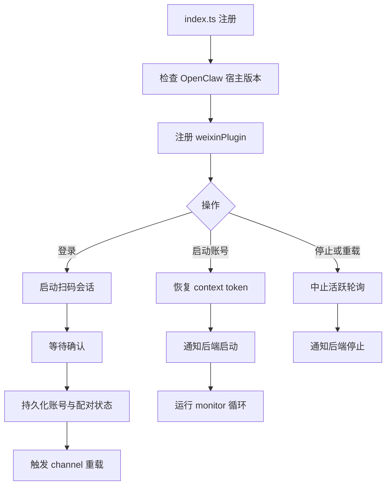
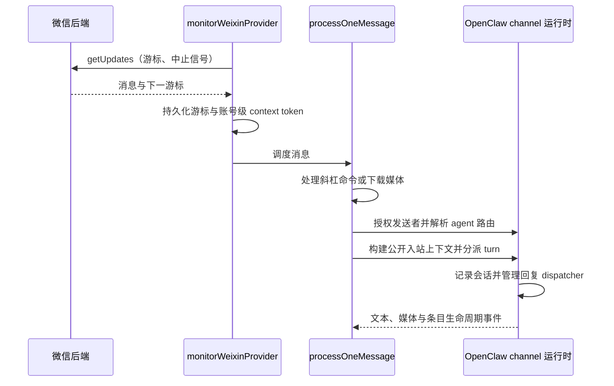
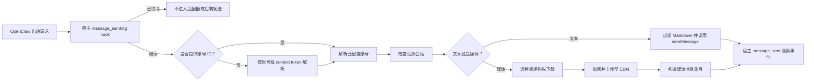

# 架构说明

[English](../en/architecture.md)

`openclaw-weixin` 将微信 HTTP/CDN 协议适配到 OpenClaw channel 运行时。插件负责
登录、账号状态、长轮询、消息转换和出站媒体传输；OpenClaw 负责路由、会话、命令
授权、回复生成、hook 和统一媒体存储。

线级接口与消息结构详见[后端 API 协议](./backend-api.md)。

## 组件地图

| 组件 | 职责 |
| --- | --- |
| `index.ts` | 校验宿主兼容性并注册 channel |
| `src/channel.ts` | 实现 OpenClaw channel 契约与账号生命周期 |
| `src/auth/` | 扫码登录、账号持久化、ID 兼容和配对 |
| `src/api/` | 构造已鉴权的后端请求并分类失败 |
| `src/monitor/monitor.ts` | 轮询更新、持久化游标并调度入站任务 |
| `src/messaging/process-message.ts` | 授权、路由、准备上下文与媒体，并投递单条入站消息的回复 |
| `src/messaging/inbound-turn.ts` | 选择宿主公开分派契约，适配 hook 与生命周期归属 |
| `src/messaging/send*.ts` | 将出站文本和媒体转换为后端消息条目 |
| `src/cdn/`、`src/media/` | 加密、上传、下载、解密并转码媒体 |
| `src/storage/` | 解析状态路径并持久化轮询游标 |

## 插件与账号生命周期

插件/channel ID 和状态目录结构都是兼容性边界。登录成功后，可以替换同一微信用户的
过期账号记录，但不得静默合并无关账号。

## 入站流程

普通消息会串行处理，直到 OpenClaw 接受当前 turn；随后轮询即可接纳下一条消息。插件
审批命令使用独立调度通道，因此活跃的普通 turn 不会阻塞审批。

`inbound-turn.ts` 使用 `inbound.buildContext`，选择 `inbound.dispatch`；仅在后者
不存在时使用公开的旧版 `inbound.dispatchReply`。两条路径均将会话记录和 dispatcher
清理交给宿主，失败不会改走另一契约重试。OpenClaw 2026.6.1 下限和账号级状态不变。
延后回复的进度发送器保留到宿主完成回调触发，而非初次分派返回时关闭。

## 出站流程

现代入站回复和直接出站发送使用宿主 hook；旧版入站和独立调试消息保留本地 hook，
旧版通过原样返回载荷的 `beforeDeliver` 禁用 SDK 的重复文本修改。原始投递返回既有
客户端消息 ID，不会再次进入另一条拥有 hook 的发送路径。

存在多个账号时，只有恰好能选出一个账号，才允许省略账号 ID。上下文缺失或存在歧义时
必须失败，不得冒险使用错误的 bot 发送消息。

## 持久化状态

除非框架已有覆盖设置，以下路径均相对于 OpenClaw 状态目录。

| 路径 | 内容 |
| --- | --- |
| `openclaw-weixin/accounts.json` | 已注册的主 bot-hash 账号 ID（monitor） |
| `openclaw-weixin/account-aliases.json` | 可选的 1:1 `别名 → hash` 映射，用于绑定和出站 |
| `openclaw-weixin/accounts/<accountId>.json` | token、后端 URL、保存时间和关联用户 ID |
| `openclaw-weixin/accounts/<accountId>.sync.json` | `getUpdates` 游标 |
| `openclaw-weixin/accounts/<accountId>.context-tokens.json` | 该账号的收件人 context token |
| `openclaw-weixin/replay-dedupe/<accountId>.json` | 入站 `getUpdates` 重放墓碑（保留 24 小时；较新的宿主可能将路径映射到 SQLite） |
| `credentials/openclaw-weixin-<accountId>-allowFrom.json` | 框架配对允许列表 |
| `openclaw.json` | channel 配置和账号覆盖项 |

加载器保留对旧版原始 ID、旧版单账号凭据文件和旧版同步游标路径的回退兼容。更改这些
回退逻辑时必须添加迁移测试。

## 失败与隐私边界

- 后端 HTTP 错误会附带可操作的上下文，但不会暴露原始 authorization token 或
  context token。
- token 过期后，该账号的所有请求都会暂停，之后才恢复轮询。
- 长轮询接收 Gateway 中止信号，因此停止或重载无需等待服务端超时。
- 媒体日志必须隐去 URL 和加密查询参数。
- 测试和示例使用 `account-1`、`user-1` 等合成 ID。

## 测试接缝

- API 测试替换 `fetch`，并断言请求和响应边界。
- monitor 测试模拟轮询、游标持久化、context 存储和消息处理。
- 消息处理测试使用最小化的强类型 channel 运行时 fake。
- 账号和存储测试将 `OPENCLAW_STATE_DIR` 指向隔离的临时目录。
- 共用 builder 位于 `test/helpers/`；测试专用文件不得输出到 `dist/`。
